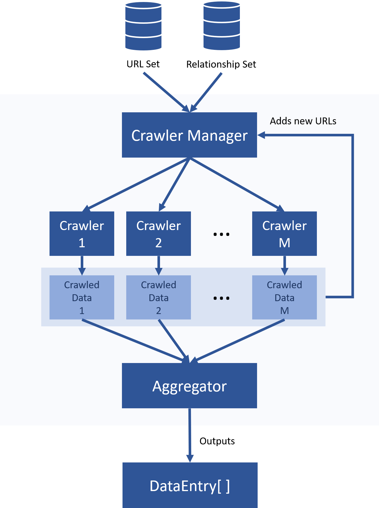

# Elf Crawler Module

This module is responsible for providing data to the **Knowledge Base** and allow it to reason on the provided data.

## Usage

### Running the .jar file
We provide an easy way of using the Crawler module with a jar file. The file accepts different flags that allow the user to customize some of the Crawler parameters, as well as providing the locations of the *URLSet* file and the *RelationshipSet* file.

Usage:
```crawler.jar [flags]```

For more detailed information, as well as a full list of available flags, please refer to [Crawler Jar](docs/crawlerjar.md).

### Using in existing code
First, create a  **CrawlerManager** object:
```java
Set<String> urlSet = readURLSet("url-set.json"); 
RelationshipSet rs = new RelationshipSet("relationship-set.json");
CrawlingManager cs = new CrawlingManager(urlSet, rs);
```
Where `readURLSet()` reads a .json file and build a String set from it. Alternatively, you can supply the urlSet in any fashion you want.

Secondly, call `executeAllCrawlers()` and store data:
```java
List<DataEntry> dataEntries = cs.executeAllCrawlers();
```
<br />
Don't forget to shutdown the crawlers, otherwise, the threads will keep running:

```java
cs.shutdownScheduler();
```
<br />

Now, just iterate the **DataEntry**'s and processed in any way you see fit.

## How it works

The crawler module uses a **Crawler Manager** to perform the crawling of all objects, it manages and assigns **Crawler** entities for the assigned URLs in the *URLSet*. The manager will use as many threads as available b0y the CPU, therefore exploiting all the parallelism it can.  

<br>
<div style="text-align: center;">

</div>
<br>

## URL Set
An URL set is the set of all crawlerAddresses that the manager will perform crawling on. If new crawlerAddresses are discovered, they will also be crawled until a certain depth. In order to not crawl any new url that wasn't initially provided, the user can pass a max crawling depth of 1. Notice that for each crawled document, the amount of newly found crawlerAddresses grows exponentially, on average, so a huge depth may cause the system to run out of memory or take an exponential amount of time. 

## Relationship Set
A relationship set tells how to build a <class>DataEntry</class>  given the contents of the download files. Currently, the Crawlers support HTML, JSON and CSV files. The file types have to be specified in the URL set.

## String Variables (New)
Sometimes, a URL can be dynamic and, as such, it may load different data, based on the URL path.

Some URLs might, for example, load data dependent on the begin date and end date specified at the URL.
 
For these situations, we introduce some variables, which may be added at any URL or **RelationshipSet** entry. These variables are replaced with their true values at runtime.
 
The full list of variables are:
* **{date.current}** The full date of today in *dd/MM/YY* format
* **{date.current.day}** The day of today, in a  number
* **{date.current.month}** The current month, in a number 
* **{date.current.year}** The current year, in a number
* **{date.current.month.begin}** The full date, in *dd/MM/YY* format, of the beginning of the current month
* **{date.current.month.end}** The full date, in *dd/MM/YY* format, of the end of the current month
* **{java.version}** The current JVM version where this crawler is currently running on

*Example: 16 of February of 2018:*
<br>
*{date.current} = 16/02/2018*
<br>
*{date.current.day} = 16*
<br>
*{date.current.month} = 02*
<br>
*{date.current.year} = 2018*
<br>
*{date.current.month.begin} = 01/02/2018*
<br>
*{date.current.month.end} = 28/02/2018*

## Known Issues
* *SLF4J* prints to console undesirably. This happens because of a third party library that includes the Logger and provides no way of disabling it. If this undesirable printing becomes too much of a hassle, I can implement my own JPath parser.