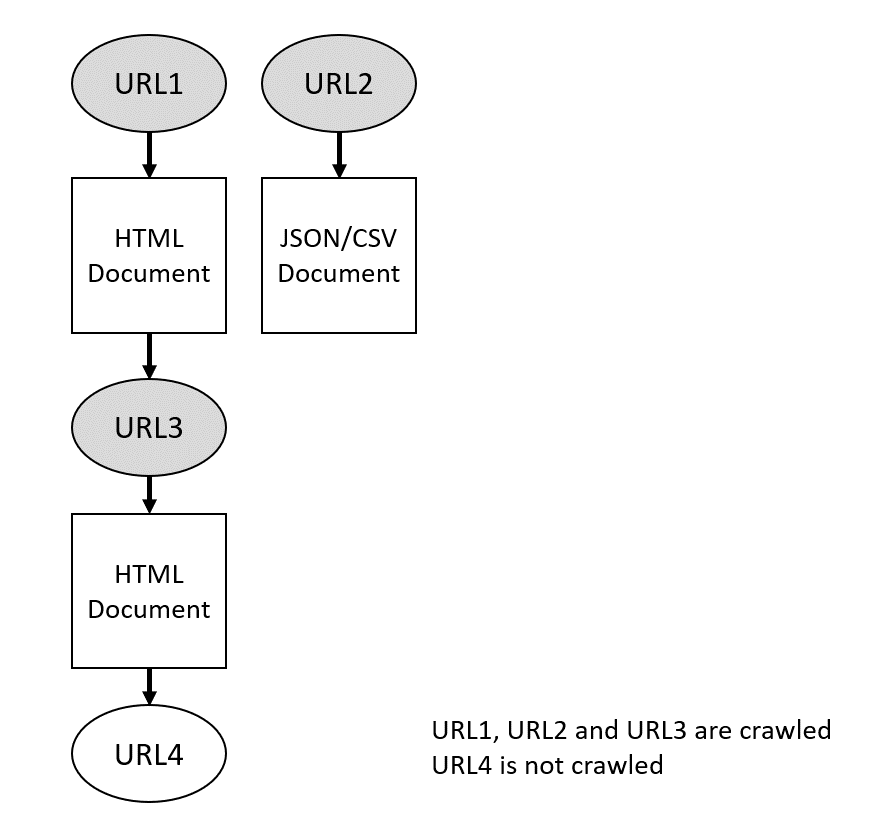

## Crawler Jar  
  
The jar file is an easy and quick way of using the Crawler module. The file accepts different flags that allow the user to customize some of the Crawler parameters, as well as providing the locations of the *URLSet* file and the *RelationshipSet* file.  
  
### Usage  
Running the jar file:  
```crawler.jar [flags]```  
  
### Flags  
  
All flags can be inserted in any order you desire. Some flags are mandatory and others are optional. For the optional ones, not providing them will load the default values.  
<br>  

**-continuous** 
<br>
*Optional*

Sets the crawler to run continuously, with a default value of 720 minutes *(12 hours)* between each crawl cycle.
  
**-continuous [sleep-time-minutes]**  
*Optional*

Sets the crawler to run continuously, with a given sleep time in minutes between each crawl cycle.
 
**-d [depth]**  
*Optional, DEFAULT = 1*  
  
Sets the maximum depth that will be crawled. Basically, whenever an *HTML* document contains crawlerAddresses to other websites, the Crawler will add them to the crawling queue. This is done up to a limit, which is called the **maximum crawling depth**. All the urls in the *URLSet* have a depth of 0. Any url found on any *HTML* document of these urls will have a depth of 1 and so on. A document is only crawled if it has a depth lower than $maxdepth - 1$. Depth must be an integer equal or greater than 1.  
  
*Example:*  
```  
crawler ... -d 2  
```   
Means the crawler will crawl all the URLs provided in the *URLSet* and any URLs found in the documents inside it. But even if URLs are found inside URLs of URLs, they will not be crawled.  
  
  
  
**Warning! As depth increases, the amount of crawled documents increases exponentially. A large value will ultimately cause an** ***OutOfMemoryException***  
<br>  
  
  
**-h, -help**  
*Optional*  
  
Prints the description of the flags to the console.  
<br>  
  
**-host [hostname]**  
*Optional DEFAULT = "localhost"*  
  
Sets the hostname of the KB server. The port will be defaulted to *5666*  
  
**-host [hostname] [port]**  
*Optional DEFAULT_HOSTNAME = "localhost", DEFAULT_PORT = 5666*  
  
Sets the hostname and the port of the KB server.  
<br>  
  
**-l, -log, -loglevel [log level]**  
*Optional DEFAULT = 3*  
  
Sets the *Logger*'s logginf level to either  
  
*"1"* or *"error"* **Error only**  
*"2"* or *"warn"*  **Error and Warnings**  
*"3"* or  *"info"* **Error, Warnings** and **Information**  
<br>  
  
**-r, -relations [filename]**  
*Required*  
  
Sets the location of the *RelationshipSet* json file.   
<br>  
  
**-u, -urls [filename]**  
*Required*  
  
Sets the location of the *URLSet* json file.   
<br>  
  
**-t, -threads [number of threads]**  
*Optional DEFAULT = Number of CPU Threads*  
  
Sets how many threads to use while crawling. Each Crawler runs on a thread, so this essentially means how many documents can be crawled concurrently.

**-tag,-taglist [filename]**
*Required*

Sets the location of the *TagsList* json file. This file is necessary when connecting to the KB, in order to document all the tags used by the produced tuples by the crawler.