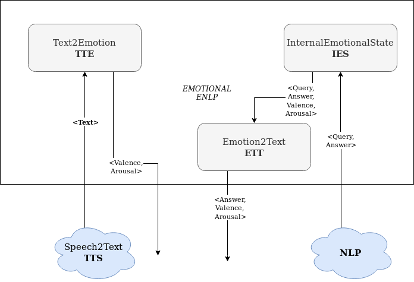

# Emotional NLP group (ENLP)

The code contained in this folder addresses three main tasks.

Running the file enlp_app.py will start three sevices: text to emotion, emotion to text and ELF internal emotional state (described below).
Each service runs in its own thread.

The general architecture of our ENLP is pictured below, where arrows represent tuples published on the KB and arrows ending in a node represent awakening of the final node when the tuple on the edge is published.




## Text to Emotion (TTE)
When the user talks with ELF he produces a sentence, often a query. The user sentence published on the KB awakes the module `EttService_c.py`  that in turn calls functions contained in `tte.py`. This module associates an emotion to the sentence and publishes in the KB a tuple made like this:

```
tuple = {
  "timestamp": int,
  "valence": float,
  "arousal": float,
  "language" : string,
  "tag": "ENLP_USER_EMOTION"

}
```
The `tag` field has to be used to query for this kind of information. Emotion is given following Russell's circumplex model of affect. `language` indicates the language of the original user sentence and is forwarded. `timestamp` is forwarded for analytics purposes.

## ELF Internal Emotional State (IES)
In order to provide a realistic answer to the user the module has to compute what is the emotional state of ELF itself.
The service `IESService_c.py` is dedicated to this task. It retrieves from the KB all the useful information and then it computes the internal state.
It publishes on the KB the result of this computation in the following format:
```
emotion = {
  "timestamp" : int,
  "valence" : float,
  "arousal" : float,
  "query" : user_query,
  "answer" : nlp_answer,
  "tag": "ENLP_ELF_EMOTION"
}
```
where `valence` and `arousal` coordinates identify the ELF's internal emotional state. The ELF emotion is related to the pair `query`, `answer` taken from NLP group.

## Emotion to Text (ETT)
When ELF reply to the user he has to do so in a human-like way. In order to accomplish this task the module `EttService_c.py` is awakened every time an answer that has to be provided to the user is published to the KB. The module calls in turn functions contained in `ett.py` in order to:
1. Retrieve from the KB ELF internal emotional state calculated previously with the module `IES`
2. Elaborate a modified version of the default answer taken from the KB. This new version has some emotional content that follows ELF's internal emotional state.

The module publishes in the KB the tuple related to the new answer to be provided to the user, in the following format:

```
answer = {
  "timestamp": int,
  "text" : colored_answer,
  "valence" : float,
  "arousal" : float,
  "tag": "ENLP_EMOTIVE_ANSWER",
  "language" : string
}
```
where `valence` and `arousal` coordinates identify the emotion with which the answer has to be given to the user and `text` provides the text of the answer augmented with emotional content. `language` is used during answer augmentation and forwarded.

## Tags of other modules
1. We use `"TEXT_F_AUDIO"` as the tag to identify the user sentence transcript tuple and the field `"text"` to retrieve the actual transcript. The field `"language"` identifies the text language.

1. We use `"NLP_ANSWER"` as the tag to identify the tuple containing the text of the reply to be given to the user. The text is directly contained in the value of the tag field.

## INSTALL
`pip install -r requirements.txt`

## RUN
In order to run all the components of this module simply execute, after installing prerequisites, the command

`python enlp_app.py`
